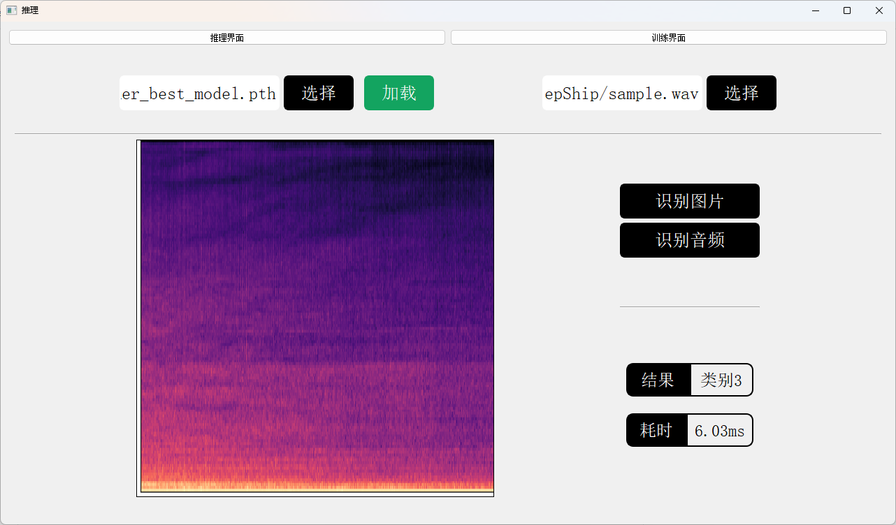
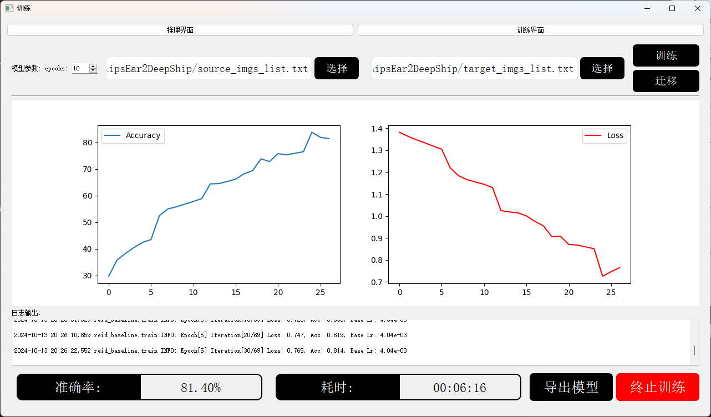

## Usage

1. all windows:

    ```bash
    python main_ui.py
    ```

2. train windows:

    ```bash
    python train_ui.py
    ```

3. inference windows:

    ```bash
    python inference_ui.py
    ```

## Overview




## Process

### 训练界面

- [x]  迁移按钮功能实现
- [x]  输入参数框排版调整
- [x]  最终的准确率显示修正
- [ ]  导出模型按钮实现
- [x]  预训练部分功能

### 推理界面

- [x]  将单个模块的垂直布局改为水平布局，让界面简洁
- [x]  合并单张图片识别和文件夹图片识别功能
- [x]  更醒目的提示错误路径功能

### 主界面

- [x]  将首页设置为简洁的推理识别界面
- [x]  修改标题栏以实现对推理界面和训练界面的区分
- [ ]  icon 添加，训练和推理界面的
